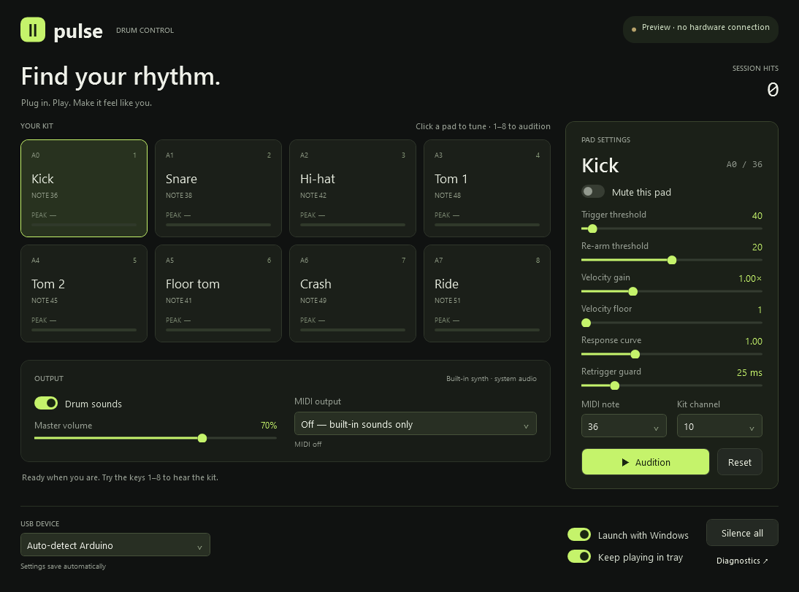

# Pulse

A small native Windows app for Arduino piezo drums. Plug in your kit, hit a pad, and play. No Connect or Apply buttons.



## Use it

Download **Pulse-Windows-x64.zip** from Releases. Run `Pulse.exe` directly, or run `install.ps1` in PowerShell for a per-user installation and a Start menu shortcut. The installer enables launch at Windows sign-in; you can turn that off inside Pulse or install with `-NoStartup`. No administrator access is required.

Requires 64-bit Windows 10/11 with .NET Framework 4.8 and the USB driver for your board. The executable uses Windows' framework and audio APIs; its small file size does not include Windows components. There is no browser runtime, Python installation, account, or network connection involved in playing.

1. Close Arduino Serial Monitor and the old drum bridge so the USB port is free.
2. Open Pulse and plug in the Nano. It scans automatically, including after unplug/replug.
3. Hit a pad to verify the firmware's data. Saved thresholds are then sent automatically.
4. Click a pad to tune it. Keys **1–8**, a double-click, or **Audition** play a test hit. Test hits are separate from the real session count.

For immediate standalone sound, enable **Drum sounds**. Pulse includes eight synthesized percussion voices. For Ableton or another DAW, choose an existing MIDI output; that selection is remembered and reopened automatically. An existing virtual MIDI cable such as your `Nano Drums 1` port is still needed for routing between Windows applications. Pulse does not install a virtual MIDI driver. Disable built-in sounds if the DAW already produces audio.

Closing the window keeps the bridge running when **Keep playing in tray** is enabled. Use the tray menu's **Exit** to stop it. Starting Pulse a second time brings the existing instance forward. **Launch with Windows** starts it in the tray at sign-in.

## Controls

- Per-pad trigger and re-arm thresholds, sent to the Arduino.
- Per-pad velocity gain, floor, response curve, retrigger guard, mute, and MIDI note mapping, processed on the PC.
- Master sound volume, sound toggle, MIDI output, and kit MIDI channel.
- Eight decaying velocity meters with last measured raw ADC peak, and a real hit counter.
- Automatic saving, USB reconnect, saved MIDI output reconnect, and device diagnostics.

Trigger threshold is restricted to **2–1022**, and re-arm to **1–(trigger−1)**. This avoids a zero re-arm threshold (the original sketch can never re-arm below zero) and a trigger of 1023 (which would divide by zero in the sketch's velocity mapping). Lower trigger values increase sensitivity. A curve below 1 makes soft hits louder. The retrigger guard suppresses repeat hits on the PC; it is not firmware crosstalk cancellation.

Settings live in `%LOCALAPPDATA%\PulseDrums\settings.xml`, with the previous save kept as `.bak`. Device logs are bounded and saved alongside it. **Reset** restores the selected pad to general defaults, not to a hardware calibration.

## Existing kit profile

`profiles/current-kit.xml` transcribes the supplied Nano Drum MIDI screenshot:

| Pad | Trigger | Re-arm | MIDI note |
| --- | ---: | ---: | ---: |
| Kick | 140 | 40 | 36 |
| Snare | 20 | 5 | 38 |
| Hi-hat | 20 | 10 | 42 |
| Tom 1 | 20 | 5 | 48 |
| Tom 2 | 10 | 1 | 45 |
| Floor tom | 60 | 1 | 41 |
| Crash | 10 | 5 | 49 |
| Ride | 10 | 9 | 51 |

All pads use velocity floor **50**, gain **1**, curve **0.6**, and no additional retrigger guard. The MIDI channel is **1**, with output **Nano Drums 1** and built-in sounds off. Install using `install.ps1 -ImportCurrentKit` to seed these values only if no Pulse settings already exist. The general app defaults remain suitable for a fresh kit.

## Firmware compatibility

Designed against the serial interface in [marwans200/Arduino-Drums](https://github.com/marwans200/Arduino-Drums), specifically [Durms.ino](https://github.com/marwans200/Arduino-Drums/blob/main/Durms.ino). This is an independent app implementation; the upstream executable and Python source are not bundled.

Serial: **115200 baud, 8-N-1**. Each hit must send a `NOTE,note,velocity` line followed by `RAW,pad,peak` within 250 ms. Pads are indexed 0–7. Mapping uses the RAW pad index, so changed incoming note numbers are supported. Pulse writes complete `SET,RESET,pad,value` and `SET,HIT,pad,value` lines, paced 25 ms apart.

The original sketch has no identification query, settings acknowledgment, heartbeat, or EEPROM persistence. Pulse opens likely Arduino USB adapters (Arduino, CH340, FTDI, CP210x), waits for valid NOTE/RAW data before writing settings, and remembers the verified USB identity. These adapter identifiers are shared by other devices, so **Auto-detect is a candidate search, not unique hardware identification**. With several candidates it cycles every eight seconds until a hit verifies one; select a port once if needed. Opening a serial port may reset a Nano. Allow roughly two seconds for boot, and hit a pad once for verification. Pulse can detect unplugging, but cannot distinguish an idle kit from stalled firmware while the port remains open.

No firmware is flashed. A NOTE-only or binary-MIDI sketch requires adaptation. The reference sketch also has a blocking 10 ms peak scan per pad; desktop software cannot remove that acquisition latency. Pulse's four 256-frame audio buffers at 48 kHz account for about 21 ms of queued audio, plus Windows and hardware latency. End-to-end latency is not claimed to be measured or zero.

## Build and verify

```powershell
.\build.ps1 -Test
.\bin\Pulse.exe --smoke
```

Builds with the .NET Framework C# compiler already included in Windows; no NuGet downloads. `make-icon.ps1` regenerates the original app icon. `--smoke` renders the actual WPF UI to `artifacts/`, exercises the controls, and does not open a serial port or change user settings. Tests cover malformed/fragmented input, threshold safety, persistence, velocity processing, synth generation, and native audio initialization. Audio initialization requires a working Windows output device.

Hardware checks still require the physical kit: hit all eight pads, change a threshold, unplug/replug, and verify your DAW's MIDI reception. Desktop tests alone cannot prove the installed sketch accepts settings, or that your DAW is receiving audio/MIDI.

Installed files: `%LOCALAPPDATA%\Programs\Pulse`. To uninstall, exit Pulse, disable **Launch with Windows**, remove the installation folder and the Pulse Start menu shortcut. Keep or remove `%LOCALAPPDATA%\PulseDrums` depending on whether you want to retain settings.
