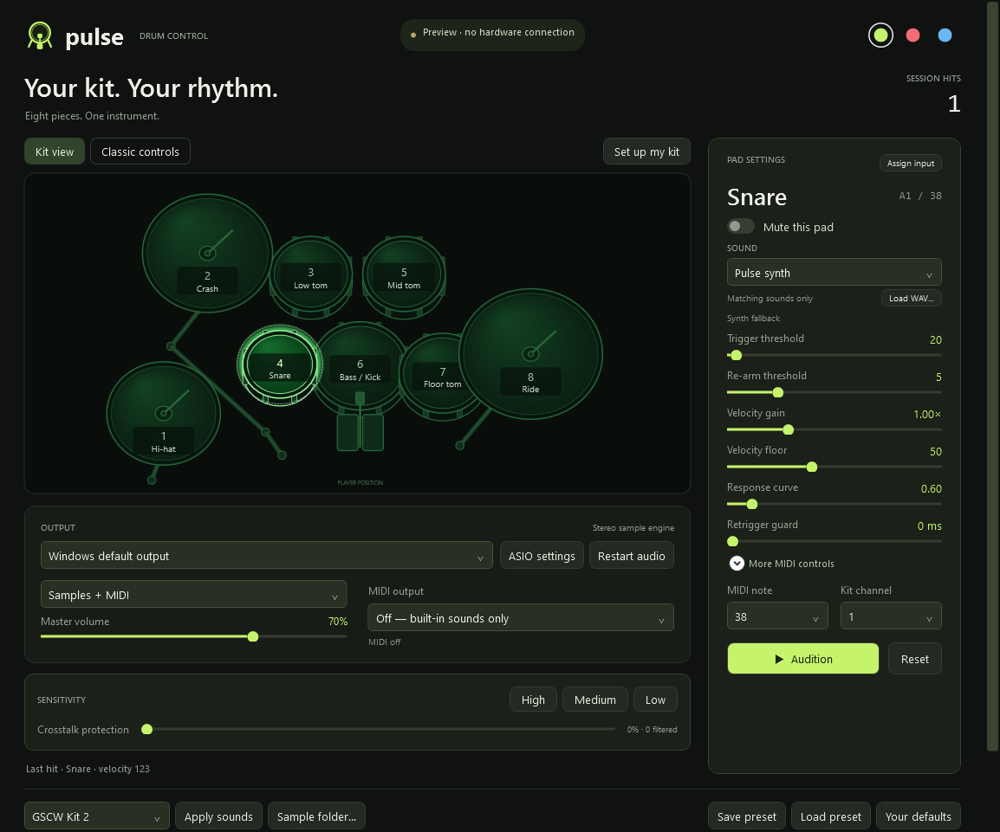

# Pulse 2

Native Windows control for an Arduino piezo drum kit: automatic USB connection, a playable top-down kit, pad learning, stereo samples and MIDI.



## Install

Download **Pulse-Windows-x64.zip** from [Releases](https://github.com/Maxy747/pulse-drums/releases). Extract it and run `install.ps1` in PowerShell. This creates a Start menu shortcut, enables launch at Windows sign-in, and downloads the GSCW sample library if it is missing. No administrator access is needed. Use `-NoStartup` to skip sign-in launch or `-WithoutSamples` to install only the synth/MIDI app. `Pulse.exe` can also run directly; run `download-samples.ps1` once for the sample library.

Requires Windows 10/11 x64, .NET Framework 4.8, a Windows audio output and your board's USB driver. The app has no Python/browser dependency. Samples take roughly 301 MB and remain in `%LOCALAPPDATA%\PulseDrums\Samples\GSCW` across app updates. Internet access is needed for the initial download, not for playing.

## Play

Close Arduino Serial Monitor and the old drum bridge to free the port. Open Pulse, plug in the Nano, and hit a pad once to verify the serial protocol. Saved thresholds are sent automatically. No Connect, Apply or Save-settings button is needed.

The default view follows the numbered physical kit. Pieces glow on a hit, independently and simultaneously. The three colour dots at the top right switch between **Green**, **Red**, and **Blue**; the selected dot has an outline. The USB/COM indicator is centred. Theme and view choices are remembered. Click a piece to tune it; double-click, press **1–8**, or use **Audition** to test its sound. **Classic controls** switches to the previous pad-card view.

| Number | Instrument | Initial input | Default MIDI note |
| --- | --- | --- | ---: |
| 1 | Hi-hat | A2 | 42 |
| 2 | Crash | A6 | 49 |
| 3 | Low tom | A4 | 45 |
| 4 | Snare | A1 | 38 |
| 5 | Mid tom | A3 | 48 |
| 6 | Bass / Kick | A0 | 36 |
| 7 | Floor tom | A5 | 41 |
| 8 | Ride | A7 | 51 |

The numbers describe physical positions, **not wiring**. If inputs are swapped, learn them:

1. Choose **Set up my kit** for all eight pieces, or select a piece and choose **Assign input**.
2. Strike only the requested instrument **twice**. Pulse picks the largest raw peak in each short capture window and uses a brief ringing guard to keep one strike from counting twice.
3. Two matching strikes confirm the input and move to the next piece automatically. If the strikes disagree or an input was already assigned, it keeps listening. There are no Confirm or Next buttons.
4. Full setup saves after all eight pieces have been confirmed twice. Cancel discards the draft. One-piece assignment works the same way and swaps the displaced input so two pieces cannot accidentally share one sensor.

**Undo last part** restores the map from before the last confirmed assignment and listens for that piece again. It can be used repeatedly, including on the completion panel. Before any part is confirmed, it clears the first strike. Undoing a completed setup reopens the draft; cancelling that draft restores the map from before that setup session.

Sounds are paused during setup. Learning uses real serial sensor peaks, not mouse/keyboard auditions. The same assignment controls the kit glow, sample and MIDI note. Trigger calibration remains attached to each physical Arduino input. A sensor must exceed its current firmware threshold to be detected; adjust the threshold if a pad never registers.

## Sounds and Ableton

The first sample-enabled run loads **GSCW Kit 2** with **V05 for every piece** and selects direct playback. Both GSCW kit presets use V05 by default. Pick **GSCW Kit 1**, **GSCW Kit 2**, or **Pulse synth** in the bottom selector and choose **Apply sounds** to change the whole kit. Individual sample choices and named presets remain editable and are remembered.

The selected drum's **Sound** picker lists only that instrument's samples: crash for Crash, snare for Snare, and separate low/mid/floor tom categories. Splash samples are excluded from Crash. **Load WAV…** accepts your own matching sound; known filenames from another instrument are rejected. **Sample folder…** points Pulse at a different downloaded library. Sample loading happens off the hit-processing thread; failed loads retain the previous sound and show a message.

Output choices:

- **Samples** plays directly through the default Windows audio output.
- **Ableton / MIDI only** sends notes to the selected MIDI output without direct audio.
- **Samples + MIDI** enables both.

For Ableton, choose your existing loopMIDI output, then enable that input in Ableton and arm the instrument track. On this PC Windows calls the port **Nano Drums**, whereas the old Python UI displayed **Nano Drums 1**. Pulse remembers the output and retries when it becomes available. It does not install a virtual MIDI driver.

The audio-device selector offers **Windows default output** and installed **ASIO** drivers. For Scarlett, choose **Focusrite USB ASIO** to send stereo audio directly to outputs 1/2 through the Focusrite driver. **ASIO settings** opens its buffer/sample-rate panel; **Restart audio** retries a failed connection. Selection persists. MIDI-only mode releases the audio device for the DAW. Pulse uses 48 kHz; driver resets trigger reinitialization. A missing/busy ASIO device shows an error instead of silently routing to other speakers.

The status reports the driver buffer and output latency, not end-to-end drum latency. Low buffers can cause crackles; raise the buffer in [Focusrite Device Settings](https://support.focusrite.com/hc/en-gb/articles/208814065-How-to-change-sample-rate-buffer-size-in-Windows) if needed. On the development PC, the Scarlett successfully opened at 32 samples with 3.2 ms reported output latency. Audible performance still needs listening confirmation.

WAV playback supports mono/stereo PCM 8/16/24/32-bit and float32, with sample-rate conversion in memory to 48 kHz stereo. Original files are not rewritten. One-shots are limited to 60 seconds/128 MB. GSCW Kit 1 has no separate 12-inch tom, so its Low tom preset uses the matching 12-inch sample from Kit 2; Kit 2 has distinct 10/12/13-inch choices. See [sample source and license notes](THIRD-PARTY.md).

## Your defaults and saved presets

The supplied calibration is now the factory default:

| Input | Trigger | Re-arm |
| --- | ---: | ---: |
| A0 | 140 | 40 |
| A1 | 20 | 5 |
| A2 | 20 | 10 |
| A3 | 20 | 5 |
| A4 | 10 | 1 |
| A5 | 60 | 1 |
| A6 | 10 | 5 |
| A7 | 10 | 9 |

Velocity floor **50**, ceiling **127**, gain **1**, curve **0.6**, MIDI channel **1**, transpose **0**, and note length **10 ms**. The extra PC retrigger guard defaults to **0 ms**. Open **More MIDI controls** for velocity ceiling, transpose and note length.

**Save preset** creates a named `.pulse.xml` file. **Load preset** restores input assignments, calibration, sound selections, notes, volume, output mode, channel, transpose and note length. Device identity, the local sample folder and this PC's MIDI-port selection are retained. Missing sample paths are matched by unique filenames in the local library when possible. Otherwise the UI reports the missing sound.

**Your defaults** restores the supplied calibration and default musical MIDI values, keeping input assignments and samples. **Reset** restores only the selected input's calibration and that instrument's default MIDI note. Normal edits auto-save to `%LOCALAPPDATA%\PulseDrums\settings.xml`, with a `.bak` copy of the previous save. Existing saved settings are kept during upgrades.

Trigger values are constrained to 2–1022 and re-arm values to 1–(trigger−1). Response curves below 1 make softer hits louder.

### Sensitivity and unwanted triggers

The three sensitivity buttons change trigger/re-arm thresholds, ringing guards and crosstalk protection for all inputs while keeping mappings, sounds and MIDI notes:

| Preset | Threshold multiplier over your original calibration | Quiet-time guard | Crosstalk rejection |
| --- | ---: | ---: | ---: |
| High | 0.75× | 35 ms | 25% |
| Medium | 1.5× | 70 ms | 45% |
| Low | 2.5× | 110 ms | 60% |

The quiet-time guard ignores continuous sensor ringing until that input has been quiet for the selected interval. Crosstalk protection compares raw peaks over 6 ms, rejects weaker neighbouring triggers, and guards against vibration tails for 25 ms. At 45%, a neighbouring peak below 45% of a stronger hit is rejected. Only accepted hits reach session counting, samples and MIDI. Set crosstalk to zero to remove its comparison delay. High protection can suppress soft simultaneous strokes or fast rolls; use High sensitivity or lower the individual guard when needed.

On the first 2.1 launch, existing thresholds and mappings are retained, guards are raised to at least 70 ms, and crosstalk starts at 45%. **Your defaults** still restores the original screenshot calibration, including zero extra guard and no crosstalk filter. These settings are editable and saved in named presets. The filters operate on the PC; firmware is unchanged.

## Background operation

When **Keep playing in tray** is enabled, closing the window keeps the kit active. Use the tray icon's **Exit** to stop it. **Launch with Windows** starts Pulse in the tray. Opening it again brings the existing instance forward. **Silence all** stops active sample voices and MIDI notes.

Diagnostics include USB state, sample load errors and MIDI availability. The bounded device log is saved in `%LOCALAPPDATA%\PulseDrums\device.log`.

## Arduino compatibility and limits

Based on the serial interface in [Durms.ino](https://github.com/marwans200/Arduino-Drums/blob/main/Durms.ino): **115200 baud, 8-N-1**, with `NOTE,note,velocity` followed by `RAW,pad,peak` within 250 ms. Raw input indexes are 0–7. Changed incoming note numbers are supported because identity comes from RAW. Assigned instrument notes are used for MIDI output.

Pulse sends `SET,RESET,pad,value` and `SET,HIT,pad,value`, paced 25 ms apart. The firmware is not flashed. It has no identification handshake, settings acknowledgment, heartbeat or EEPROM persistence. Pulse opens likely Arduino USB adapters and verifies the NOTE/RAW pair before restoring settings. Opening a Nano's port may reset it; allow about two seconds for boot and strike one pad to verify it. An idle kit cannot be distinguished from stalled firmware while its port stays open.

Arduino/CH340/FTDI/CP210x identifiers are candidate hints, not unique drum-kit IDs. With multiple candidates, Pulse cycles every eight seconds until one is verified. A port can also be selected once and remembered.

The reference sketch's blocking 10 ms peak scan remains unchanged. Windows output queues six 256-frame buffers at 48 kHz (32 ms), uses the multimedia scheduler, and reports empty-queue events. ASIO uses the driver's callback buffer instead of that Windows queue. End-to-end latency includes firmware, serial, any crosstalk window and the output device; it has not been measured. Use Restart audio after a device change or connection failure.

## Build and test

```powershell
.\build.ps1 -Test
.\bin\Pulse.exe --smoke
```

Uses the .NET Framework 4.8 compiler shipped with Windows. Pinned NAudio ASIO/Core libraries and a registry compatibility assembly are vendored and embedded, so the executable remains standalone with no package restore. Licenses and provenance are in `vendor/NAudio` and THIRD-PARTY.md. The local tests cover trigger bursts, crosstalk, mapping, learning, presets, WAV decoding and audio mixing. When the sample library is present, all 360 WAVs are decoded. CI uses `-NoAudio`. Optional `Pulse.Tests.exe --asio-probe --audio-stress` opens Focusrite ASIO silently and stress-tests the Windows queue at low volume.

The WPF smoke test renders kit/classic/hit/setup screenshots and exercises assignment, cancel, reset, preset restore and control changes without opening a serial port or writing user settings. Actual pad identification and audible DAW reception require hands-on testing.

Installed app: `%LOCALAPPDATA%\Programs\Pulse`. To remove it, exit the tray app, disable sign-in launch, and remove that folder and its Start menu shortcut. Settings, presets and samples can be retained or removed separately from `%LOCALAPPDATA%\PulseDrums`.
